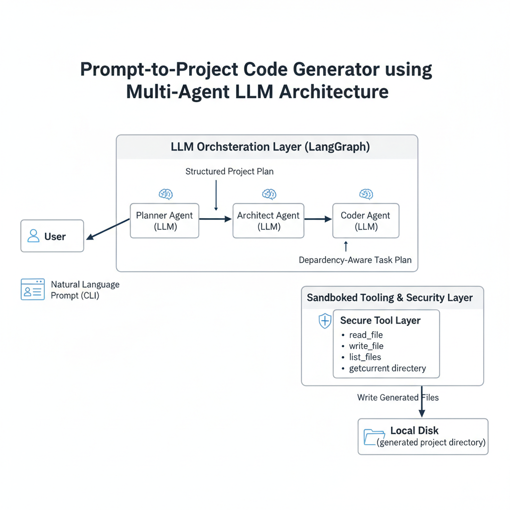

# Prompt-to-Project Code Generator using Multi-Agent LLM Architecture

This project is a **multi-agent LLM-powered system** that converts a single natural language prompt into a **fully structured software project** by autonomously planning, architecting, and generating code on the local filesystem.

The system mimics a real-world software engineering workflow by separating responsibilities across **Planner**, **Architect**, and **Coder** agents, coordinated using **LangGraph**.

---

## 🚀 Key Features

* **Prompt-to-Project Automation**: Generate an entire software project from a single CLI prompt.
* **Multi-Agent Architecture**: Planner → Architect → Coder pipeline for structured reasoning.
* **Deterministic Planning**: Uses Pydantic-based structured outputs to enforce predictable plans and tasks.
* **Dependency-Aware Code Generation**: Tasks are ordered and executed based on implementation dependencies.
* **Secure File Generation**: Sandbox-protected filesystem tools prevent unsafe file writes.
* **Stateful Execution**: Maintains task progress using a recursive, state-driven execution loop.

---

## 🧠 System Architecture




### Architecture Explanation

* **Planner Agent**: Interprets the user intent and produces a structured project plan (features, tech stack, files).
* **Architect Agent**: Decomposes the plan into ordered, dependency-aware implementation tasks.
* **Coder Agent**: Iteratively executes tasks, generating or modifying files using tool-based access.
* **Tool Layer**: Acts as a sandboxed interface for filesystem operations, preventing unsafe writes.
* **Local Disk Output**: All generated artifacts are stored safely under `generated_project/`.

Each agent has a clearly defined responsibility and communicates via structured state objects.

---

## 🛠️ Tech Stack

* **Language**: Python 3.10+
* **LLM Orchestration**: LangGraph, LangChain
* **LLM Provider**: Groq (LLM-backed structured outputs)
* **Data Validation**: Pydantic
* **CLI Interface**: argparse
* **Filesystem Automation**: pathlib, subprocess

---

## 📁 Project Structure

```
.
├── main.py                 # CLI entry point
├── agent/
│   ├── graph.py            # LangGraph workflow definition
│   ├── tools.py            # Secure filesystem & utility tools
│   ├── states.py           # Pydantic state and schema definitions
│   ├── prompts.py          # Planner, Architect, Coder prompts
│   └── __init__.py
├── generated_project/      # Auto-generated output projects
├── .env                    # Environment variables
└── README.md
```

---

## ⚙️ How It Works (Agent Responsibilities)

### 1️⃣ Planner Agent

* Converts user intent into a structured **Project Plan**
* Defines:

  * Application name
  * Description
  * Tech stack
  * Features
  * Required files

### 2️⃣ Architect Agent

* Breaks the plan into **explicit implementation tasks**
* Orders tasks based on dependencies
* Specifies function names, imports, and integration details

### 3️⃣ Coder Agent

* Iteratively executes each task
* Reads existing files (if any)
* Writes full file content using sandboxed tools
* Maintains progress using a state object

---

## 🔐 Security Considerations

* All file writes are restricted to the `generated_project/` directory
* Path traversal attacks are prevented using strict path validation
* No system-level commands are executed unless explicitly enabled

---

## ▶️ Getting Started

### 1. Clone the Repository

```bash
git clone https://github.com/your-username/autodev.git
cd autodev
```

### 2. Create Virtual Environment

```bash
python -m venv venv
source venv/bin/activate  # Windows: venv\Scripts\activate
```

### 3. Install Dependencies

```bash
pip install -r requirements.txt
```

### 4. Configure Environment Variables

Create a `.env` file:

```env
GROQ_API_KEY=your_api_key_here
```

### 5. Run the Project

```bash
python main.py
```

Enter your project prompt when asked:

```text
Enter your project prompt: Create a simple calculator web application using html, css and javascript
```

Generated files will appear inside the `generated_project/` directory.

---

## 📌 Example Prompts

```
Create a to-do list application using html, css, and javascript.
Create a simple calculator web application.
Create a simple blog API in FastAPI with a SQLite database```

---

## 🎯 Use Cases

* Rapid project scaffolding
* Learning software architecture patterns
* Experimenting with autonomous LLM agents
* Research in AI-assisted software engineering

---

## 🔮 Future Enhancements

* Add **Reviewer Agent** for code validation
* Unit test generation
* FastAPI-based web interface
* Versioned file generation
* Dockerized execution

---

## 📄 License

This project is licensed under the **MIT License**.

---

## 🙌 Acknowledgements

Inspired by modern research in **LLM-based autonomous agents** and **AI-assisted software engineering**.

---

## 👤 Author

**Sharmile**
